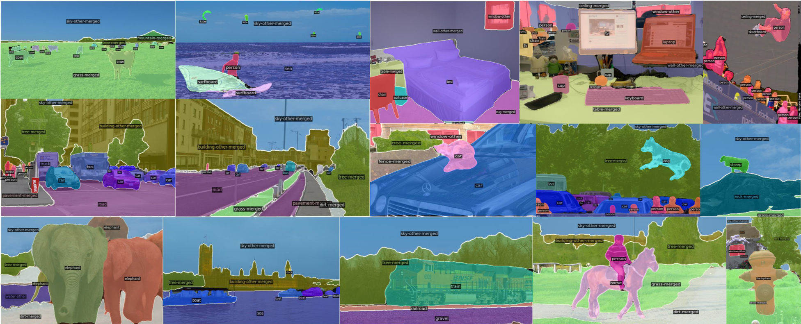

This is the project page for paper:
>[**You Only Segment Once: Towards Real-Time Panoptic Segmentation**](https://arxiv.org/abs/2303.14651), In CVPR 2023.



## Model Zoo

On COCO validation set:
| Backbone | Scale | PQ | FPS| GPU | Model
|:---:|:---:|:---:|:---:|:---:|:---:|
|R50|800,1333|48.4|23.6|V100| [model](https://github.com/hujiecpp/YOSO/releases/download/v0.1/yoso_res50_coco.pth) |
|R50|512,800|46.4|45.6|V100|[model](https://github.com/hujiecpp/YOSO/releases/download/v0.1/yoso_res50_coco.pth)|

On Cityscapes validation set:
| Backbone | Scale | PQ | FPS| GPU | Model
|:---:|:---:|:---:|:---:|:---:|:---:|
|R50|1024,2048|59.7|11.1|V100|[model](https://github.com/hujiecpp/YOSO/releases/download/v0.1/yoso_res50_cityscapes.pth)|
|R50|512,1024|52.5|22.6|V100|[model](https://github.com/hujiecpp/YOSO/releases/download/v0.1/yoso_res50_cityscapes.pth)|

On ADE20k validation set:
| Backbone | Scale | PQ | FPS| GPU | Model
|:---:|:---:|:---:|:---:|:---:|:---:|
|R50|640,2560|38.0|35.4|V100|[model](https://github.com/hujiecpp/YOSO/releases/download/v0.1/yoso_res50_ade20k.pth)|

On Mapillary Vistas validation set:
| Backbone | Scale | PQ | FPS| GPU | Model
|:---:|:---:|:---:|:---:|:---:|:---:|
|R50|2048,2048|34.1|7.1|A100|[model](https://github.com/hujiecpp/YOSO/releases/download/v0.1/yoso_res50_mapillary.pth)|

## Getting Started
### Installation
We recommend to use [Anaconda](https://www.anaconda.com/) for installation.
```bash
conda create -n YOSO python=3.8 -y
conda activate YOSO
conda install pytorch==1.10.1 torchvision==0.11.2 cudatoolkit=11.3 -c pytorch
pip install pycocotools -i https://pypi.douban.com/simple
pip install git+https://github.com/cocodataset/panopticapi.git
git clone https://github.com/hujiecpp/YOSO.git
cd YOSO
python setup.py develop
```

### Datasets Preparation
See [Preparing Datasets for Mask2Former](https://github.com/facebookresearch/Mask2Former/tree/main/datasets).

### Training & Evaluation

- Train YOSO (e.g., on COCO dataset with R50 backbone).
```bash
python projects/YOSO/train_net.py --num-gpus 4 --config-file projects/YOSO/configs/YOSO-R50.yaml
```

- Evaluate YOSO (e.g., on COCO dataset with R50 backbone).
```bash
python projects/YOSO/train_net.py --num-gpus 4 --config-file projects/YOSO/configs/YOSO-R50.yaml --eval-only MODEL.WEIGHTS ./model_zoo/yoso_res50_coco.pth
```

### Inference on Custom Image or Video

- Run YOSO demo (e.g., on video with R50 backbone).
```bash
python demo/demo.py --config-file projects/YOSO/configs/YOSO-R50.yaml --video-input input_video.mp4 --output output_video.mp4 --opts MODEL.WEIGHTS ./model_zoo/yoso_res50_coco.pth
```

## Acknowledgements

- [Mask2Former](https://github.com/facebookresearch/Mask2Former)
- [K-Net](https://github.com/ZwwWayne/K-Net)

## Citing YOSO

If YOSO helps your research, please cite it in your publications:

```BibTeX
@article{hu2023yoso,
  title={You Only Segment Once: Towards Real-Time Panoptic Segmentation},
  author={Hu, Jie and Huang, Linyan and Ren, Tianhe and Zhang, Shengchuan and Ji, Rongrong and Cao, Liujuan},
  journal={arXiv preprint arXiv:2303.14651},
  year={2023}
}
```
